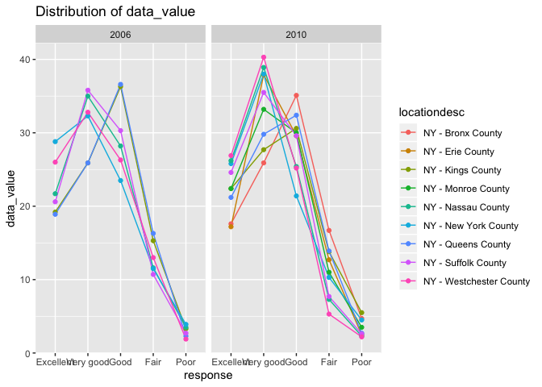
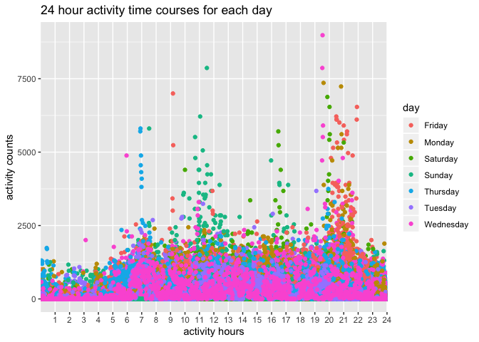

hw3
================
Wurongyan Zhang
10/7/2019

``` r
library(tidyverse)
library(ggridges)
library(gridExtra)
library(data.table)
library(p8105.datasets)
data("instacart")
```

## problem 1

Comment: The data instacart contains 15 variables and 1384617 rows which
means there are 1,384,617 observations of 131,209 unique users with each
row showing the product from one order. The key variables are:

order\_dow: the day of the week on which the order was placed

order\_hour\_of\_day: the hour of the day on which the order was placed

product\_name: name of the product

aisle: the name of the aisle

department: the name of the department

For example, for the first row, the customer purchased on thursday
10:00. The product name is “Bulgarian Yogurt” and purchased from aisle
“yogurt” and department “dairy eggs”.

There are 134 aisles in total and the most items are ordered from aisle
“fresh vegetables” which has aisle id of 83.

``` r
insta = instacart %>% 
  group_by(aisle) %>% 
  count() %>% 
  arrange(n)
insta[which.max(pull(insta,n)),1]
```

    ## # A tibble: 1 x 1
    ## # Groups:   aisle [1]
    ##   aisle           
    ##   <chr>           
    ## 1 fresh vegetables

``` r
more = insta %>% 
  filter(n>10000) 

ggplot(more,aes(x=aisle, y=n))+
  geom_bar(stat = "identity",fill=6)+
  theme(axis.text.x = element_text(angle = 90, hjust = 0.9))+
  labs(title = "number of items ordered in each aisle", x="aisle name", y="number of items")
```

<!-- --> Comment: The
plot is showing aisles with more than 10,000 items being ordered with
the number of items ordered in each aisle. We can see from the plot that
in the aisles “fresh vegetables”, “fresh fruits” and “packaged vegetable
fruits” are three aisles sold the most items.

``` r
bake = instacart %>% 
  filter(aisle=="baking ingredients") %>% 
  group_by(product_name) %>% 
  count() %>% 
  arrange(desc(n)) %>% 
  head(3)

dog = instacart %>% 
  filter(aisle=="dog food care") %>% 
  group_by(product_name) %>% 
  count() %>% 
  arrange(desc(n))%>% 
  head(3)

pak = instacart %>% 
  filter(aisle=="packaged vegetables fruits") %>% 
  group_by(product_name) %>% 
  count() %>% 
  arrange(desc(n))%>% 
  head(3)

all1= full_join(pak, dog)
```

    ## Joining, by = c("product_name", "n")

``` r
all = full_join(all1,bake) 
```

    ## Joining, by = c("product_name", "n")

``` r
aisle=c("packaged vegetables fruits","packaged vegetables fruits","packaged vegetables fruits","dog food care","dog food care","dog food care","baking ingredients","baking ingredients","baking ingredients")
bind =
  as.data.frame(aisle)
all3=as.data.frame(c(all, bind)) %>% 
  select(aisle,everything())
all3
```

    ##                        aisle                                  product_name
    ## 1 packaged vegetables fruits                          Organic Baby Spinach
    ## 2 packaged vegetables fruits                           Organic Raspberries
    ## 3 packaged vegetables fruits                           Organic Blueberries
    ## 4              dog food care Snack Sticks Chicken & Rice Recipe Dog Treats
    ## 5              dog food care           Organix Chicken & Brown Rice Recipe
    ## 6              dog food care                            Small Dog Biscuits
    ## 7         baking ingredients                             Light Brown Sugar
    ## 8         baking ingredients                              Pure Baking Soda
    ## 9         baking ingredients                                    Cane Sugar
    ##      n
    ## 1 9784
    ## 2 5546
    ## 3 4966
    ## 4   30
    ## 5   28
    ## 6   26
    ## 7  499
    ## 8  387
    ## 9  336

Comment: for the aisle “baking ingredients”, the three most popular
items are “Light Brown Sugar”, “Pure Baking Soda”, and “Cane Sugar”. For
the aisle “dog food care”, the three most popular items are “Snack
Sticks Chicken & Rice Recipe Dog Treats”, “Organix Chicken & Brown Rice
Recipe”, “Small Dog Biscuits”. This aisle has the least total items sold
compared to the other two. For the aisle “packaged vegetables fruits”,
the three most popular items are “Organic Baby Spinach”, “Organic
Raspberries”,“Organic Blueberries”. This aisle has the most total items
sold compared to the other two.

``` r
pink = instacart %>% 
  filter(product_name %like% "Pink Lady Apples") %>% 
  group_by(order_dow) %>% 
  summarise(mean_hour = mean(order_hour_of_day) ) %>% 
  mutate(name = "Pink Lady Apples")
```

``` r
coffee = instacart %>% 
  filter(product_name %like% "Coffee Ice Cream") %>% 
  group_by(order_dow) %>% 
  summarise(mean_hour = mean(order_hour_of_day) )%>% 
  mutate(name = "Coffee Ice Cream")
com = rbind(pink,coffee)
pivot_wider(com,id_cols = name, names_from = order_dow, values_from = mean_hour)
```

    ## # A tibble: 2 x 8
    ##   name               `0`   `1`   `2`   `3`   `4`   `5`   `6`
    ##   <chr>            <dbl> <dbl> <dbl> <dbl> <dbl> <dbl> <dbl>
    ## 1 Pink Lady Apples  13.2  11.4  12.1  14.0  12    12.8  12.1
    ## 2 Coffee Ice Cream  13.5  13.7  15.3  15.3  14.8  12.2  13.9

Comment: For pink lady apples, customers ordered mainly from 11:00 to
14:00. For coffee ice cream, customers ordered mainly from 12:00 to
15:00. We can see that those times of the day have overlaps.

# problem 2

``` r
data("brfss_smart2010")
```

``` r
overall= brfss_smart2010 %>% 
  janitor::clean_names() %>% 
  filter(topic=="Overall Health")  %>% 
  mutate(response= factor(response,order=TRUE, levels = c("Excellent","Very good","Good","Fair","Poor"))) %>% 
  arrange(desc(response))
```

``` r
loc= overall %>% 
  filter(year%in%c("2002","2010")) %>% 
  group_by(year,locationabbr) %>% 
  count() %>% 
  arrange(desc(n)) %>% 
  mutate(n=n/5) %>% 
  #since for each location it measured for 5 times, so I used total n to divide 5
  filter(n>=7) %>% 
  arrange(year)
  
loc
```

    ## # A tibble: 20 x 3
    ## # Groups:   year, locationabbr [20]
    ##     year locationabbr     n
    ##    <int> <chr>        <dbl>
    ##  1  2002 PA              10
    ##  2  2002 MA               8
    ##  3  2002 NJ               8
    ##  4  2002 CT               7
    ##  5  2002 FL               7
    ##  6  2002 NC               7
    ##  7  2010 FL              41
    ##  8  2010 NJ              19
    ##  9  2010 TX              16
    ## 10  2010 CA              12
    ## 11  2010 MD              12
    ## 12  2010 NC              12
    ## 13  2010 NE              10
    ## 14  2010 WA              10
    ## 15  2010 MA               9
    ## 16  2010 NY               9
    ## 17  2010 OH               8
    ## 18  2010 CO               7
    ## 19  2010 PA               7
    ## 20  2010 SC               7

Comment: There are total 6 states were observed at 7 or more locations
in 2002. Also, there are total 14 states were observed at 7 or more
locations in 2010.

``` r
excellent = overall %>% 
  filter(response=="Excellent") %>% 
  group_by(year, locationabbr) %>% 
  summarise(mean(data_value)) %>% 
  `colnames<-`(c("year","state","mean_data_value"))  
  
head(excellent)
```

    ## # A tibble: 6 x 3
    ## # Groups:   year [1]
    ##    year state mean_data_value
    ##   <int> <chr>           <dbl>
    ## 1  2002 AK               27.9
    ## 2  2002 AL               18.5
    ## 3  2002 AR               24.1
    ## 4  2002 AZ               24.1
    ## 5  2002 CA               22.7
    ## 6  2002 CO               23.1

``` r
ggplot(excellent,
       aes(x=year, y=mean_data_value, color=state))+
  geom_line()+
  labs(title=" average value over time within a state")
```

    ## Warning: Removed 3 rows containing missing values (geom_path).

<!-- --> Comment: We can
see that the average value over time within a state mainly range from 15
to 30 and it does not fluctuate a lot within a state but there are some
difference between different states. For WV in 2005, the average was
extremely low compared to others.

``` r
data_year=overall %>% 
  filter(locationabbr=="NY") %>%
  filter(year%in%c("2010","2006"))

plot_year=ggplot(data_year,aes(x=factor(response, levels = c("Excellent","Very good","Good","Fair","Poor")), y=data_value, color=locationdesc, group=locationdesc))+
  geom_line()+
  geom_point()+
  labs(x="response", title = "Distribution of data_value")+
  facet_grid(~year)
plot_year
```

<!-- --> Comment: We can
see that in year 2010 there are more locations evaluated in the state
NY. In both years, “poor” has the lowest data value and “very good” has
the highest in 2010 and “good” has the highest in 2006. This means the
most of the responses are better than “good” in both years.

## problem 3

``` r
chf = read_csv("./data/accel_data.csv")
```

``` r
chf = 
  chf %>% 
  janitor::clean_names() %>% 
  mutate(days= ifelse(day =="Saturday"|day=="Sunday", "Weekend", "Weekdays")) %>% 
  pivot_longer(
    starts_with("activity_"),
    names_to = "activity_minutes",
    names_prefix = "activity_",
    values_to = "activity_counts"
  ) %>% 
  mutate(activity_minutes = factor(activity_minutes, levels = c(1:1440)))
```

There are total 6 variables and 50400 observations after tidying the
data. The “day” variable indicates the day of the week and the “days”
variable indicates if it is weekdays or weekends.

``` r
chf %>% 
  group_by(week, day_id, day) %>% 
  summarise(total_activity=sum(activity_counts)) 
```

    ## # A tibble: 35 x 4
    ## # Groups:   week, day_id [35]
    ##     week day_id day       total_activity
    ##    <dbl>  <dbl> <chr>              <dbl>
    ##  1     1      1 Friday           480543.
    ##  2     1      2 Monday            78828.
    ##  3     1      3 Saturday         376254 
    ##  4     1      4 Sunday           631105 
    ##  5     1      5 Thursday         355924.
    ##  6     1      6 Tuesday          307094.
    ##  7     1      7 Wednesday        340115.
    ##  8     2      8 Friday           568839 
    ##  9     2      9 Monday           295431 
    ## 10     2     10 Saturday         607175 
    ## # … with 25 more rows

``` r
test= chf %>% 
  select(day_id, activity_counts,day) %>% 
  group_by(day_id) %>% 
  mutate(total_activity=sum(activity_counts)) %>% 
  ggplot(aes(x=as.factor(day_id), y=total_activity))+
  geom_point()
test
```

<!-- --> From the plot
we can see that there are few days(day 2, day 24 and day 31) have low
total activities and most days the total activity times range from
\[2\times10^5\ to\ 6\times10^5\]. There is no particular trend from my
perspective.

``` r
chf %>% 
  select(activity_minutes,day_id,day,activity_counts) %>% 
  ggplot(aes(x=activity_minutes, y=activity_counts, color=day))+
  scale_x_discrete(breaks=seq(60,1440,60), labels=as.character(c(1:24)))+
  geom_point()+
  labs(x="activity hours", y="activity counts", title="24 hour activity time courses for each day")
```

<!-- -->

From the plot we can see that on the time between 8:00 to 12:00, the
activity counts are high, espectially on Sunday. On Saturday 16:00 to
17:00, the activities are high. This maybe due to people have more time
during weekends. On Thursday 7:00, the activity is high, which means
there might be some specific events happening on that day. Furthermore,
between 20:00 to 22:00, the activity counts are the highest especially
for Wednesday. However, most of the activity counts are between 0 to
2500 for each day.
