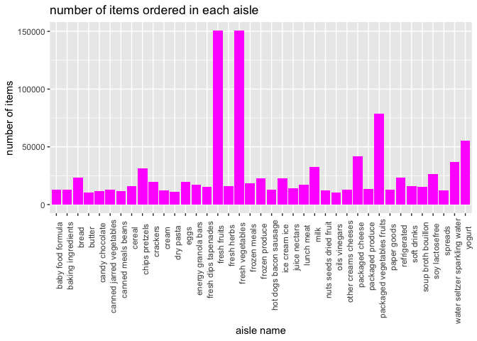
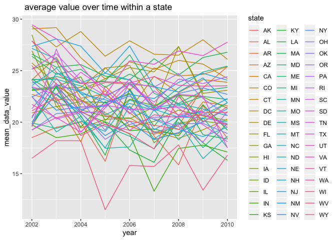
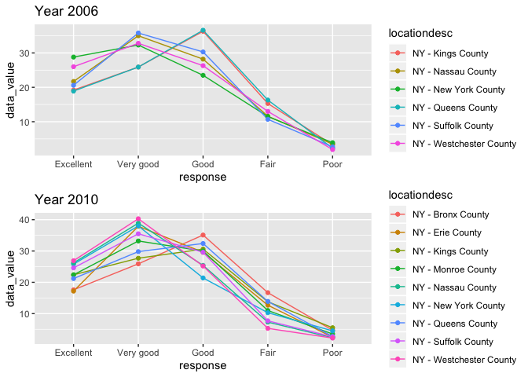
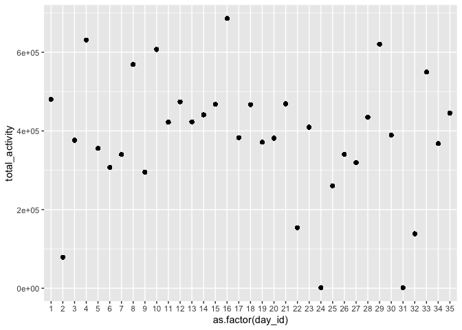
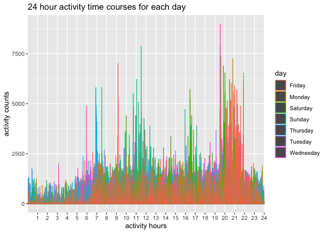

hw3
================
Wurongyan Zhang
10/7/2019

``` r
#load the library and data
library(readr)
library(tidyverse)
library(ggridges)
library(gridExtra)
library(data.table)
library(p8105.datasets)
data("instacart")
```

## problem 1

Comment: The data instacart contains 15 variables and 1384617 rows which
means there are 1,384,617 observations of 131,209 unique users with each
row showing the product from one order. The key variables are:

order\_dow: the day of the week on which the order was placed

order\_hour\_of\_day: the hour of the day on which the order was placed

product\_name: name of the product

aisle: the name of the aisle

department: the name of the department

For example, for the first row, the customer purchased on thursday
10:00. The product name is “Bulgarian Yogurt” and purchased from aisle
“yogurt” and department “dairy eggs”.

There are 134 aisles in total and the most items are ordered from aisle
“fresh vegetables” which has aisle id of 83.

``` r
#rank the aisles and find the first of the rank
insta = instacart %>% 
  group_by(aisle) %>% 
  count() %>% 
  arrange(n)
insta[which.max(pull(insta,n)),1]
```

    ## # A tibble: 1 x 1
    ## # Groups:   aisle [1]
    ##   aisle           
    ##   <chr>           
    ## 1 fresh vegetables

``` r
# filter the aisles with more than 10000 items
more = insta %>% 
  filter(n>10000) 

# make the ggplot of number of items ordered in each aisle with the data set above
ggplot(more,aes(x=aisle, y=n))+
  geom_bar(stat = "identity",fill=6)+
  theme(axis.text.x = element_text(angle = 90, hjust = 0.9))+
  labs(title = "number of items ordered in each aisle", x="aisle name", y="number of items")
```

<!-- --> Comment: The
plot is showing aisles with more than 10,000 items being ordered (which
has 39 aisles in total) with the number of items ordered in each aisle.
We can see from the plot that in the aisles “fresh vegetables”, “fresh
fruits” and “packaged vegetable fruits” are three aisles sold the most
items.

``` r
# filter those 3 aisles and get the three most popular items

bake = instacart %>% 
  filter(aisle=="baking ingredients") %>% 
  group_by(product_name) %>% 
  count() %>% 
  arrange(desc(n)) %>% 
  head(3)

dog = instacart %>% 
  filter(aisle=="dog food care") %>% 
  group_by(product_name) %>% 
  count() %>% 
  arrange(desc(n))%>% 
  head(3)

pak = instacart %>% 
  filter(aisle=="packaged vegetables fruits") %>% 
  group_by(product_name) %>% 
  count() %>% 
  arrange(desc(n))%>% 
  head(3)

# join those 3 data sets and create a table
all1= full_join(pak, dog)
all = full_join(all1,bake) 

aisle=c("packaged vegetables fruits","packaged vegetables fruits","packaged vegetables fruits","dog food care","dog food care","dog food care","baking ingredients","baking ingredients","baking ingredients")
bind =
  as.data.frame(aisle)
all3=as.data.frame(c(all, bind)) %>% 
  select(aisle,everything()) %>% 
  knitr::kable()
all3
```

| aisle                      | product\_name                                 |    n |
| :------------------------- | :-------------------------------------------- | ---: |
| packaged vegetables fruits | Organic Baby Spinach                          | 9784 |
| packaged vegetables fruits | Organic Raspberries                           | 5546 |
| packaged vegetables fruits | Organic Blueberries                           | 4966 |
| dog food care              | Snack Sticks Chicken & Rice Recipe Dog Treats |   30 |
| dog food care              | Organix Chicken & Brown Rice Recipe           |   28 |
| dog food care              | Small Dog Biscuits                            |   26 |
| baking ingredients         | Light Brown Sugar                             |  499 |
| baking ingredients         | Pure Baking Soda                              |  387 |
| baking ingredients         | Cane Sugar                                    |  336 |

Comment: for the aisle “baking ingredients”, the three most popular
items are “Light Brown Sugar”, “Pure Baking Soda”, and “Cane Sugar” with
the amount of 499, 387 and 336 respectively. For the aisle “dog food
care”, the three most popular items are “Snack Sticks Chicken & Rice
Recipe Dog Treats”, “Organix Chicken & Brown Rice Recipe”, “Small Dog
Biscuits” with the amount of 30, 28 and 26 respectively. This aisle has
the least total items sold compared to the other two. For the aisle
“packaged vegetables fruits”, the three most popular items are
“Organic Baby Spinach”, “Organic Raspberries”, “Organic Blueberries”
with the amount of 9784, 5546 and 4966 respectively. This aisle has the
most total items sold compared to the other
two.

``` r
# filter the data set with pink lady apples and the time ordered on each day of week
pink = instacart %>% 
  filter(product_name %like% "Pink Lady Apples") %>% 
  group_by(order_dow) %>% 
  summarise(mean_hour = mean(order_hour_of_day) ) %>% 
  mutate(name = "Pink Lady Apples")
```

``` r
# filter the data set with coffee ice cream and the time ordered on each day of week
coffee = instacart %>% 
  filter(product_name %like% "Coffee Ice Cream") %>% 
  group_by(order_dow) %>% 
  summarise(mean_hour = mean(order_hour_of_day) )%>% 
  mutate(name = "Coffee Ice Cream")
#combine those two data sets and create the table
com = rbind(pink,coffee)
pivot_wider(com,id_cols = name, names_from = order_dow, values_from = mean_hour)%>%
  knitr::kable()
```

| name             |        0 |        1 |        2 |        3 |    4 |        5 |        6 |
| :--------------- | -------: | -------: | -------: | -------: | ---: | -------: | -------: |
| Pink Lady Apples | 13.15000 | 11.38889 | 12.06000 | 14.02703 | 12.0 | 12.80000 | 12.10526 |
| Coffee Ice Cream | 13.48571 | 13.72727 | 15.29167 | 15.31818 | 14.8 | 12.22727 | 13.92105 |

Comment: For pink lady apples, customers ordered mainly from 11:00 to
14:00. For coffee ice cream, customers ordered mainly from 12:00 to
15:00. We can see that those times of the day have overlaps.

# problem 2

``` r
# load the data set
data("brfss_smart2010")
```

``` r
# clean the data set 
overall= brfss_smart2010 %>% 
  janitor::clean_names() %>% 
  # focus on overall health only
  filter(topic=="Overall Health")  %>% 
  # organize responses in order
  mutate(response= factor(response,order=TRUE, levels = c("Excellent","Very good","Good","Fair","Poor"))) %>% 
  arrange(desc(response))
```

``` r
# find the states that observed at 7 or more locations in 2002 and 2010
loc= overall %>% 
  filter(year%in%c("2002","2010")) %>% 
  group_by(year,locationabbr) %>% 
  count() %>% 
  arrange(desc(n)) %>% 
  mutate(n=n/5) %>% 
  #since for each location is measured for 5 times, so I used total n to divide 5
  filter(n>=7) %>% 
  arrange(year)  %>%
  knitr::kable()
  
loc
```

| year | locationabbr |  n |
| ---: | :----------- | -: |
| 2002 | PA           | 10 |
| 2002 | MA           |  8 |
| 2002 | NJ           |  8 |
| 2002 | CT           |  7 |
| 2002 | FL           |  7 |
| 2002 | NC           |  7 |
| 2010 | FL           | 41 |
| 2010 | NJ           | 19 |
| 2010 | TX           | 16 |
| 2010 | CA           | 12 |
| 2010 | MD           | 12 |
| 2010 | NC           | 12 |
| 2010 | NE           | 10 |
| 2010 | WA           | 10 |
| 2010 | MA           |  9 |
| 2010 | NY           |  9 |
| 2010 | OH           |  8 |
| 2010 | CO           |  7 |
| 2010 | PA           |  7 |
| 2010 | SC           |  7 |

Comment: There are total 6 states were observed at 7 or more locations
in 2002. Also, there are total 14 states were observed at 7 or more
locations in 2010.

``` r
# construct the dataset with only excellent responses only 
excellent = overall %>% 
  filter(response=="Excellent") %>% 
  group_by(year, locationabbr) %>% 
  # include averages of data_value for each location
  summarise(mean(data_value)) %>% 
  `colnames<-`(c("year","state","mean_data_value"))  
  
head(excellent)
```

    ## # A tibble: 6 x 3
    ## # Groups:   year [1]
    ##    year state mean_data_value
    ##   <int> <chr>           <dbl>
    ## 1  2002 AK               27.9
    ## 2  2002 AL               18.5
    ## 3  2002 AR               24.1
    ## 4  2002 AZ               24.1
    ## 5  2002 CA               22.7
    ## 6  2002 CO               23.1

Comment: The table above showing the head of the set of excellent only
and the data includes year, state and mean\_data\_value of each state in
each year.

``` r
# the spaghetti plot of average value vs year for each state
ggplot(excellent,
       aes(x=year, y=mean_data_value, color=state))+
  geom_line()+
  labs(title=" average value over time within a state")
```

    ## Warning: Removed 3 rows containing missing values (geom_path).

<!-- -->

Comment: We can see that the average value over time within a state
mainly range from 15 to 30 and it does not fluctuate a lot within a
state especially for some states but there are some differences between
different states. For WV in 2005, the average was extremely low compared
to others. However, I think this plot is hard to distinguish each state
in order to discover any trend.

``` r
# filter data for NY in 2006 and 2010
data_year=overall %>% 
  filter(locationabbr=="NY") %>%
  filter(year%in%c("2010","2006"))

# make the two panel plot for the distribution of data_value for responses in NY
plot_year=ggplot(data_year,aes(x=factor(response, levels = c("Excellent","Very good","Good","Fair","Poor")), y=data_value, color=locationdesc, group=locationdesc))+
  geom_line()+
  geom_point()+
  labs(x="response", title = "Distribution of data_value")+
  facet_grid(~year)
plot_year
```

<!-- -->

Comment: We can see that in year 2010 there are more locations evaluated
in the state NY. In both years, “poor” has the lowest data value and
“very good” has the highest in 2010 and “good” has the highest in
2006. This means the most of the responses are better than “good” in
both years.

## problem 3

``` r
chf = read_csv("./data/accel_data.csv")
```

``` r
# tidy the data set
chf = 
  chf %>% 
  janitor::clean_names() %>% 
  mutate(days= ifelse(day =="Saturday"|day=="Sunday", "Weekend", "Weekdays")) %>% 
  pivot_longer(
    starts_with("activity_"),
    names_to = "minutes",
    names_prefix = "activity_",
    values_to = "counts"
  ) %>% 
  mutate(minutes = factor(minutes, levels = c(1:1440)))
```

Comments: There are total 6 variables and 50400 observations after
tidying the data. The “day” variable indicates the day of the week and
the “days” variable indicates if it is weekdays or weekends. For other
variables, “minutes” indicates the each minute of each day; “counts”
indicates activities recorded in each minute; “week” indicates which
week is the recording and “day\_id” indicates which unique day it is.

``` r
# create table showing total activity for each day
chf %>% 
  group_by(week, day_id, day) %>% 
  summarise(total_activity=sum(counts)) %>%
  knitr::kable()
```

| week | day\_id | day       | total\_activity |
| ---: | ------: | :-------- | --------------: |
|    1 |       1 | Friday    |       480542.62 |
|    1 |       2 | Monday    |        78828.07 |
|    1 |       3 | Saturday  |       376254.00 |
|    1 |       4 | Sunday    |       631105.00 |
|    1 |       5 | Thursday  |       355923.64 |
|    1 |       6 | Tuesday   |       307094.24 |
|    1 |       7 | Wednesday |       340115.01 |
|    2 |       8 | Friday    |       568839.00 |
|    2 |       9 | Monday    |       295431.00 |
|    2 |      10 | Saturday  |       607175.00 |
|    2 |      11 | Sunday    |       422018.00 |
|    2 |      12 | Thursday  |       474048.00 |
|    2 |      13 | Tuesday   |       423245.00 |
|    2 |      14 | Wednesday |       440962.00 |
|    3 |      15 | Friday    |       467420.00 |
|    3 |      16 | Monday    |       685910.00 |
|    3 |      17 | Saturday  |       382928.00 |
|    3 |      18 | Sunday    |       467052.00 |
|    3 |      19 | Thursday  |       371230.00 |
|    3 |      20 | Tuesday   |       381507.00 |
|    3 |      21 | Wednesday |       468869.00 |
|    4 |      22 | Friday    |       154049.00 |
|    4 |      23 | Monday    |       409450.00 |
|    4 |      24 | Saturday  |         1440.00 |
|    4 |      25 | Sunday    |       260617.00 |
|    4 |      26 | Thursday  |       340291.00 |
|    4 |      27 | Tuesday   |       319568.00 |
|    4 |      28 | Wednesday |       434460.00 |
|    5 |      29 | Friday    |       620860.00 |
|    5 |      30 | Monday    |       389080.00 |
|    5 |      31 | Saturday  |         1440.00 |
|    5 |      32 | Sunday    |       138421.00 |
|    5 |      33 | Thursday  |       549658.00 |
|    5 |      34 | Tuesday   |       367824.00 |
|    5 |      35 | Wednesday |       445366.00 |

``` r
# make a plot to see the trend
test= chf %>% 
  select(day_id, counts,day) %>% 
  group_by(day_id) %>% 
  mutate(total_activity=sum(counts)) %>% 
  ggplot(aes(x=as.factor(day_id), y=total_activity))+
  geom_point()
test
```

<!-- -->

Comments: From the plot we can see that there are few days(day 2, day 24
and day 31) have low total activities and most days the total activity
times range from \[2\times10^5\ to\ 6\times10^5\]. There is no
particular trend from my perspective.

``` r
# make the plot showing 24-hour activity time courses for each day
chf %>% 
  select(minutes,day_id,day,counts) %>% 
  ggplot(aes(x=minutes, y=counts, color=day))+
  scale_x_discrete(breaks=seq(60,1440,60), labels=as.character(c(1:24)))+
   geom_bar(stat="identity",position = "dodge")+
  labs(x="activity hours", y="activity counts", title="24 hour activity time courses for each day")
```

<!-- -->

Comments: From the plot we can see that on the time between 8:00 to
12:00, the activity counts are high, espectially on Sunday. On Saturday
16:00 to 17:00, the activities are high. This maybe due to people have
more time during weekends. On Thursday 7:00, the activity is high, which
means there might be some specific events happening on that day.
Furthermore, between 20:00 to 22:00, the activity counts are the highest
especially for Wednesday. However, most of the activity counts are
between 0 to 2500 for each day.
